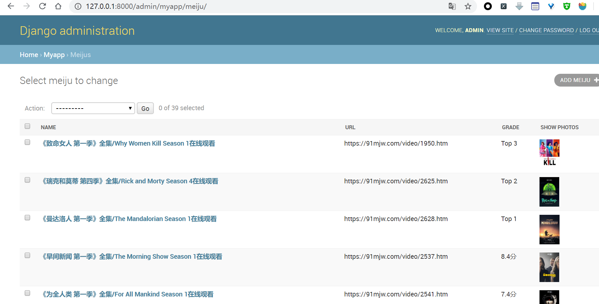

# 这个就是一个Django+ scrapy结合的模板


scrapy使用djangoItem 库，来使用django的models。这样就可以使用scrapy将爬取到的数据通过django orm框架，然后在admin中可以直接显示出来。这样就可以很方便的统一数据库，并且因为使用了orm来操作，scrapy保存的时候更为方便，就是配置的时候麻烦点，故把合并后的模板放在这儿，😂功能就是合并好后方便以后结合这两个继续开发新的东西做准备


项目的目录如下：


```python
Scrapy-django
├───mydjango(django项目)
│   │   manage.py
│   ├───myapp
│   │
│   └───mydjango
└───myscrapy（scrapy项目）
    │   scrapy.cfg
    │   
    └───myscrapy
        ├───spiders
        │   meiju.py
        │__init__.py
```


# 本模板环境依赖参考

django 2.0

scrapy 1.7.3

mysql 5.7

scrapy_djangoitem


# 示范结果



